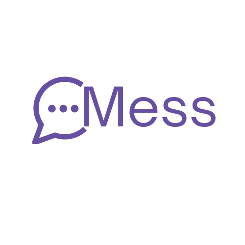

> 개발을 위한 모든 것, OMess

---
## 목차

1. [기획 배경](#-기획-배경)
2. [기능 소개](#-기능-소개)
   - [프로젝트 및 회원](#프로젝트-및-회원)
   - [모듈 소개](#모듈-소개)
     - [칸반보드](#칸반보드)
     - [API 명세서](#api-명세서-관리-및-테스트)
   - [채팅](#채팅)
3. [기술스택](#-기술스택)
4. [아키텍처](#-아키텍처)

---

## 📚 기획 배경
개발 프로젝트 진행을 하며, 필요한 문서들과 채팅을 위한 협업 툴들이 모두 분리되어 있어 불편함을 겪었습니다.  
이를 해결하기 위해 다양한 협업 툴들의 기능들을 가져와 일원화하여 보다 편리한 프로젝트 단위의 개발을 보조해줄 오픈소스 SW를 제작하고자 하였습니다.

---

## 📑 기능 소개
### 프로젝트 및 회원
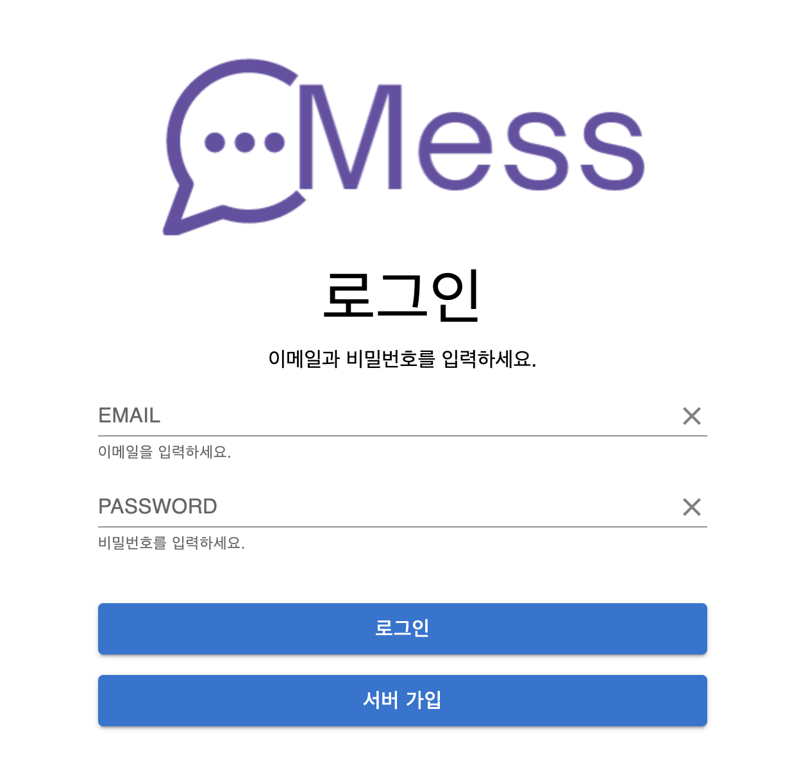
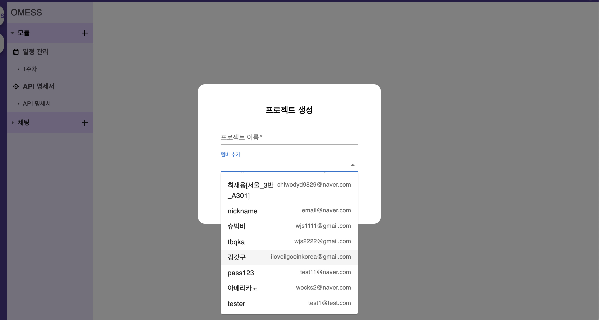
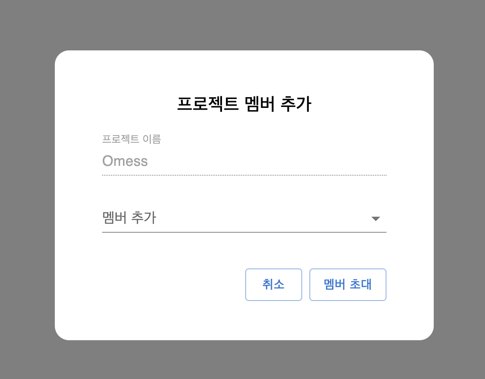
- 기본적으로 이메일을 통한 회원가입과 로그인을 제공하고 있습니다.  
- 프로젝트 생성 시 현재 서버 내 가입된 인원을 이메일로 검색하여 추가가 가능합니다.  
- 이미 생성된 프로젝트의 경우에도 회원 검색을 통해 초대가 가능합니다.

### 모듈 소개
실시간 채팅을 제외한 모든 기능은 **"모듈"** 로서 추가가 가능합니다.

**"모듈"** 은 MySQL에 저장되며, 슈퍼-서브타입 모델링을 통해 구현되었습니다. (e.g. 모델: Super, 칸반보드, API 명세서: Sub) 

- 사용자가 프로젝트 구조 파악을 보다 쉽게 하여 원활한 기능 추가를 돕기 위해 트리 형태의 테이블 구조 설계
- 트리 형태의 테이블 구조에 부모 테이블의 경로를 기록하는 path 컬럼을 추가하여 유저가 보낸 요청에 대한 유효성 검사를 path를 통해 검사하도록 하여 DB 최적화
   - ex) 1번 프로젝트의 2번 칸반보드에 3번 이슈에 대한 수정 요청 → api/v1/projects/1/kanbanboards/2/issues/3 으로 요청을 보내면 issue 테이블에서 pk 값이 3인 이슈를 조회 후 path 칼럼의 값이 P1/K2/I3인지 확인 수 서비스 로직 동작

#### 칸반보드
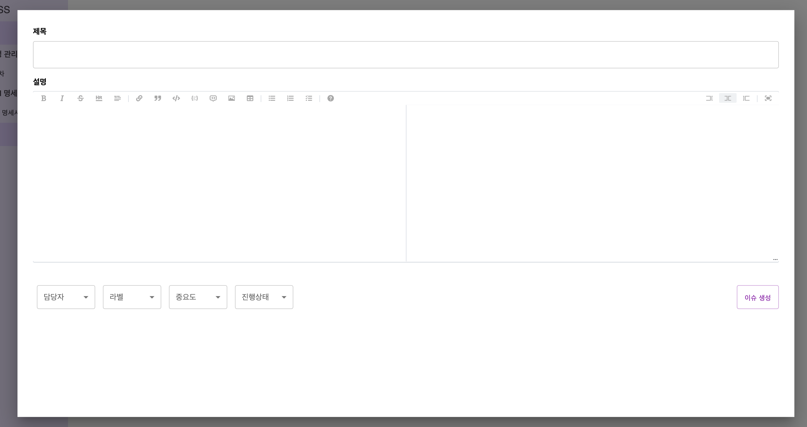
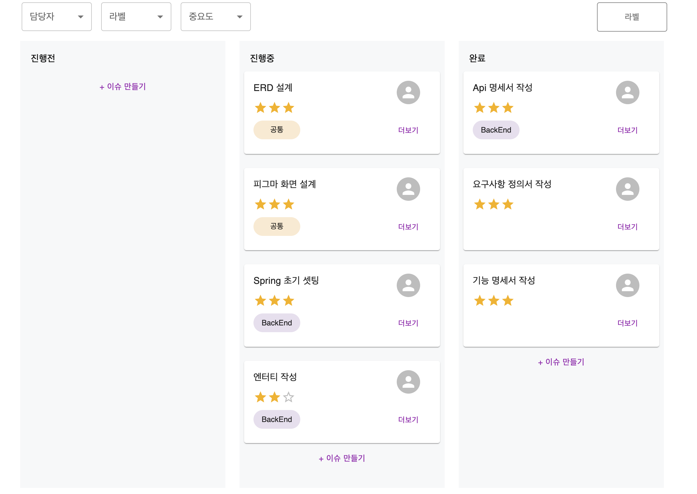

- 마크다운 에디터를 사용해 이슈 내용을 작성할 수 있도록 구현하였습니다.  

- 프로젝트 내 같은 팀원들이 이슈의 생성 및 수정 사항에 대해 인지할 수 있도록 Stomp를 사용하여 칸반보드 내부 이벤트 발생 시  
http 요청 처리 후 websocket 요청을 한번 더 보내 같은 칸반보드를 바라보고있는 유저들에게 이벤트 발생과 최신화된 issue 목록을 보내주었습니다.  

- 이슈 이벤트 발생 후 서버로 부터 최신 이슈 목록을 받아오면 사용자가 선택한 필터 조건에 맞춰 이슈 리스트를 필터링 후 전달합니다.

#### API 명세서 관리 및 테스트
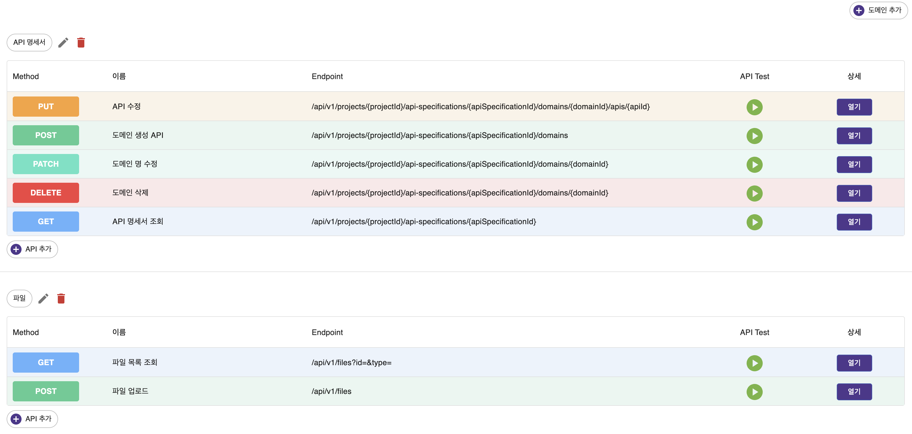
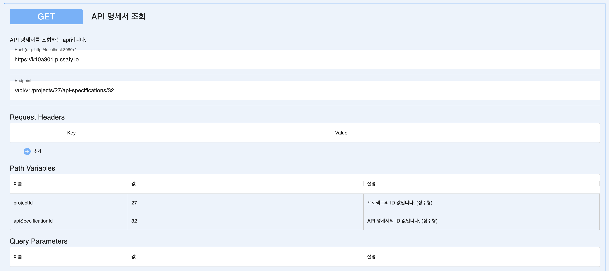
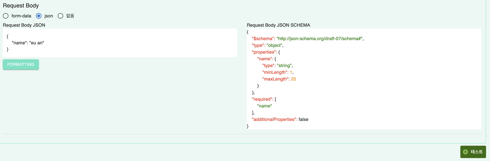
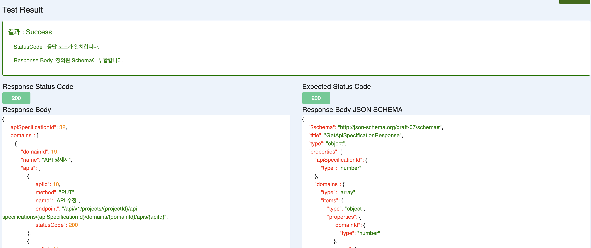

- 프로젝트 진행에 앞서 설계한 API 명세서를 기록, 관리할 수 있는 기능입니다.  
- 도메인 -> API 순으로 생성이 가능합니다.
- Request Body와 Response Body에는 **JSON SCHEMA DRAFT 07** 스펙에 맞는 json schema를 작성할 수 있습니다.  
- 작성된 API 명세서의 내용을 토대로 API Testing 기능이 제공되며, Request Body와 Response Body가 각각 요청의 전과 후에 작성된 Schema에 부합하는지 검사를 진행해줍니다.
- Request Body의 경우, 작성된 JSON SCHEMA를 통해 Sample Data를 생성해주고 있습니다.

### 채팅
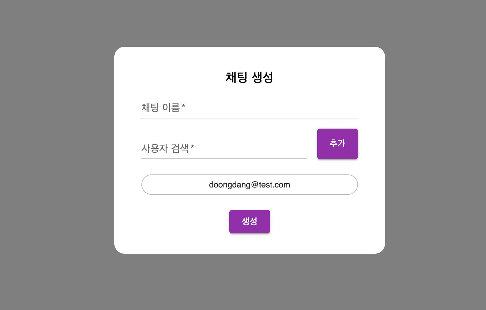
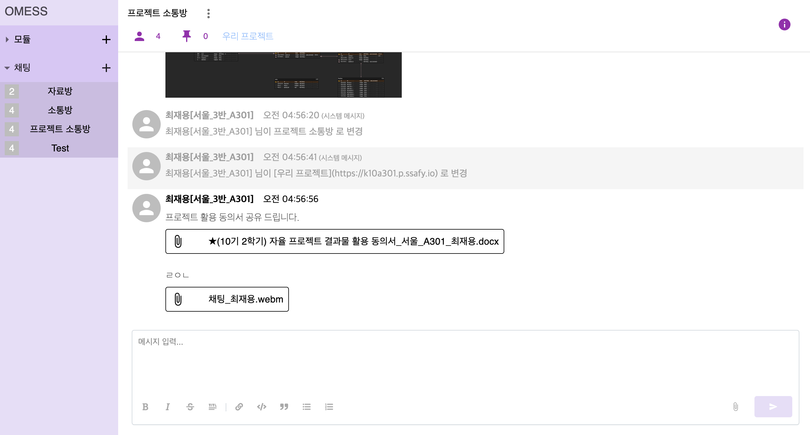
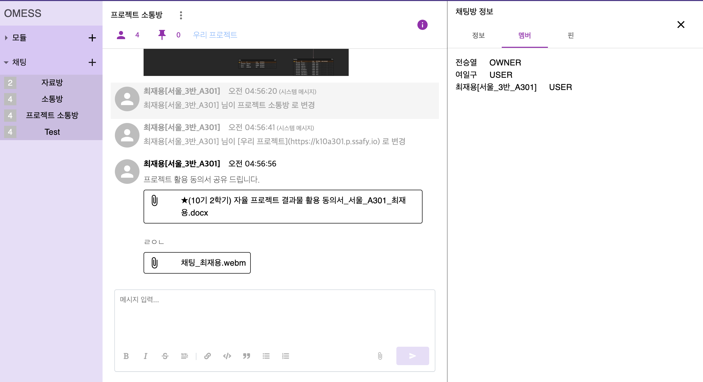

- 프로젝트 내부 인원들 간 소통이 가능한 실시간 채팅 기능을 제공하고 있습니다.  
- 마크다운 에디터를 사용하여 메시지 작성을 가능하게 하였으며, 파일 첨부 및 다운로드, 이미지 프리뷰를 구현하였습니다.

---

## 🛠️ 기술스택
### Front-End
- npm
- React 18.2.22
- TypeScript 5.2.0
- mui-material 5.15.15
- json-schema-faker 0.5.6
- crypto-js 4.2.0

### Back-End
- Java 21
- Spring Boot 
- Spring Data JPA
- QueryDSL
- Spring Boot Actuator
- WebSocket

### DB
- MySQL
- MongoDB
- MINIO 

## 🧱 아키텍처
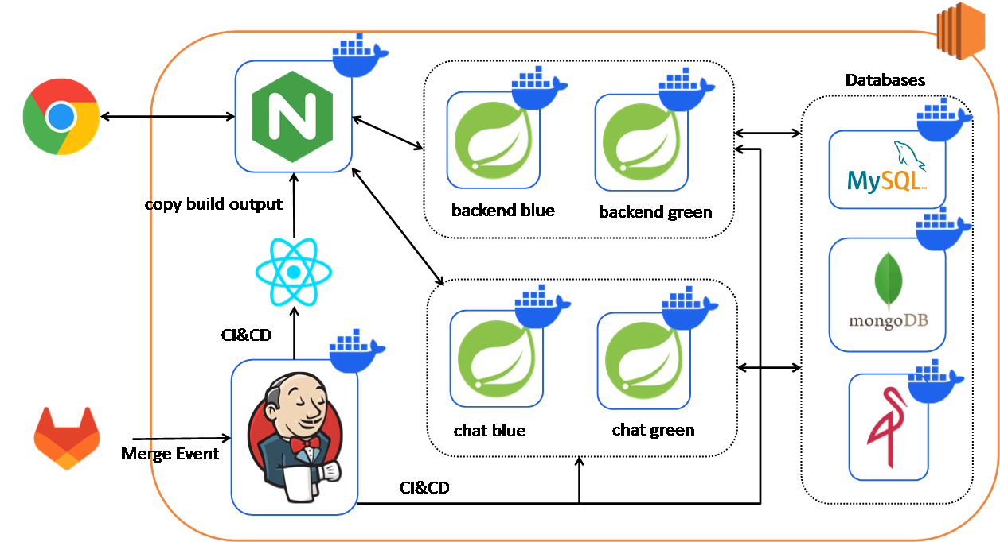