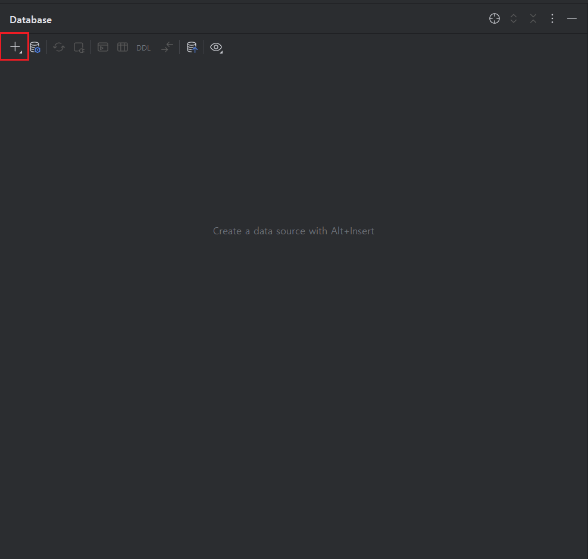
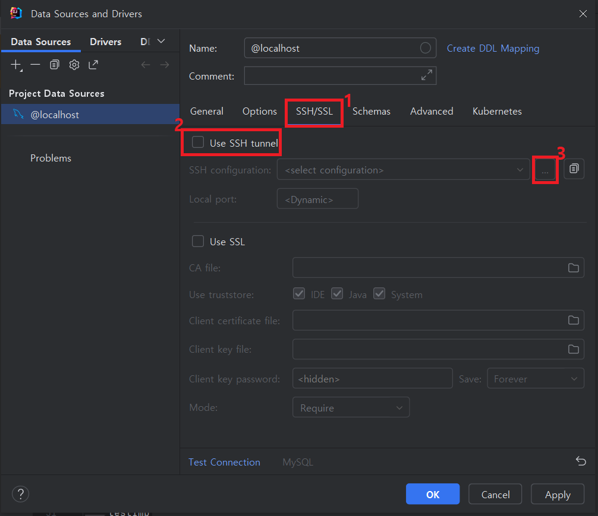
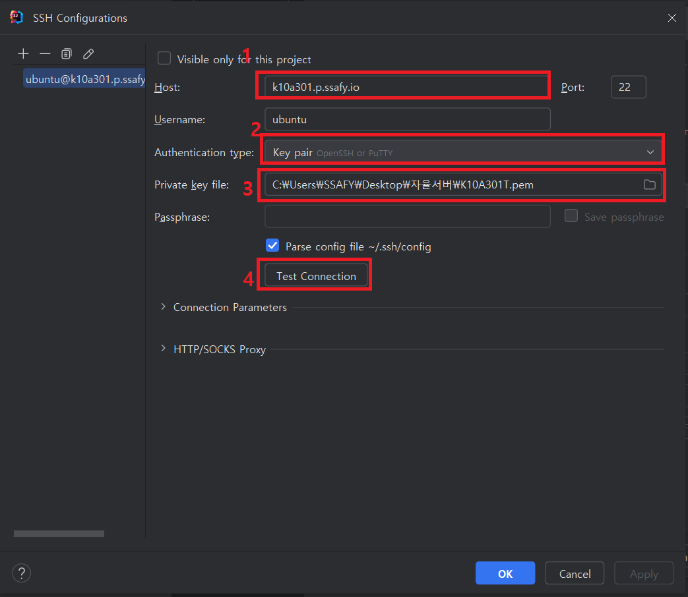
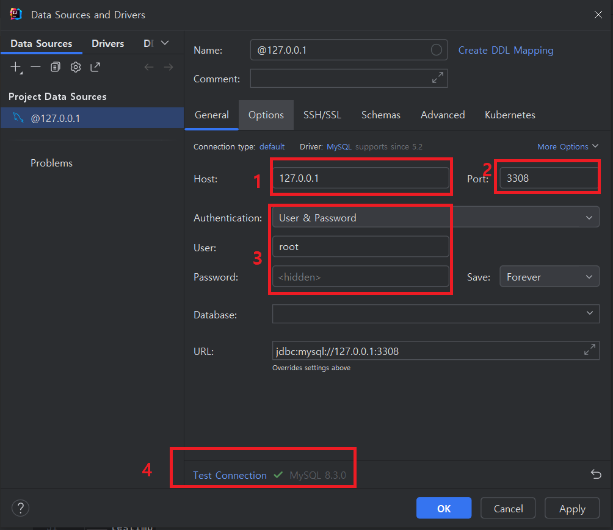

# IntelliJ에서 ssh 터널로 DB 접속 예시

- 새 datasource 추가

- SSH/SSL 탭 클릭
- SSH 터널 사용 활성화
- …을 눌러 SSH 설정 생성
    - 한 번 생성했으면 계속 사용 가능

- 서버 도메인 주소 입력
    - username은 **ubuntu**
- 인증 타입은 **Key pair**
- 서버 PEM키가 있는 경로로 설정
- Test Connection 성공 확인하고 저장

- 호스트 주소는 **반드시 127.0.0.1**
- 포트는 서버에서 로컬호스트로 바인드돼 있는 포트
- 계정 정보는 해당 DB 계정
- Test Connection 성공하면 완료